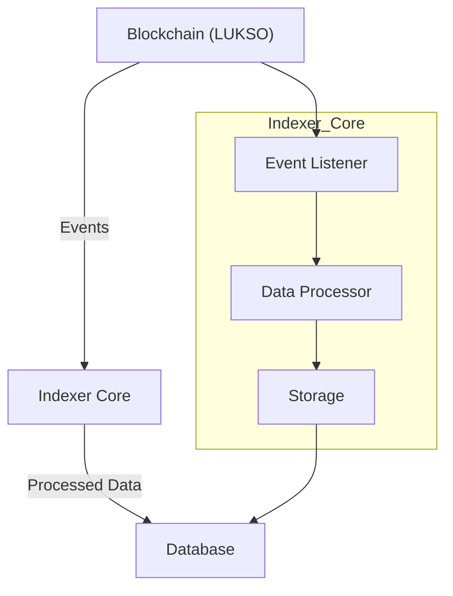
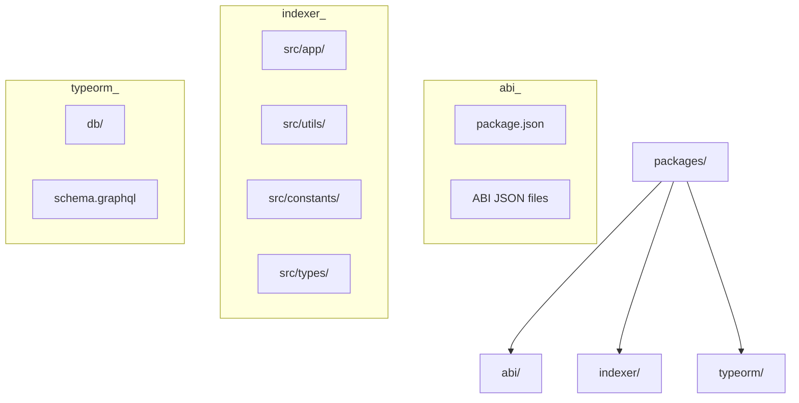
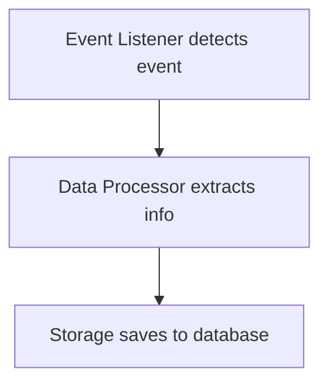

# LSP Indexer Architecture

The LSP Indexer is designed as a modular, extensible system for listening to and processing blockchain events on the LUKSO network. This document provides an overview of the project's architecture, components, and their interactions.

## High-Level Architecture

## Components

### 1. Blockchain (LUKSO)

The source of events that the indexer listens to. Relevant events include `DataChanged`, `Executed`, `UniversalReceiver`, etc.

### 2. Indexer Core

The main component responsible for:

- Listening to blockchain events
- Processing and extracting valuable information
- Storing processed data in a database

#### Key Subcomponents

- **Event Listener**: Monitors the blockchain for specific events.
- **Data Processor**: Extracts and formats data from raw events.
- **Storage**: Interfaces with the database to store processed data.

### 3. Database

Stores processed event data for querying and analysis. The indexer uses PostgreSQL as its primary database.

## Packages

The project is organized as a monorepo with several packages:

### `packages/abi/`

Contains ABI (Application Binary Interface) definitions for smart contracts. These are used to decode events from the blockchain.

- **Key Files**:
  - `package.json`
  - TypeScript configuration
  - ABI JSON files

### `packages/indexer/`

The main indexer package that listens to blockchain events and processes them.

- **Key Directories**:
  - `src/app/` - Main application logic
  - `src/utils/` - Utility functions for processing data
  - `src/constants/` - Constant values used throughout the project
  - `src/types/` - TypeScript type definitions

### `packages/typeorm/`

Handles database schema and migrations using TypeORM.

- **Key Files**:
  - `package.json`
  - `schema.graphql` - GraphQL schema for data querying

## Event Processing Flow

1. The **Event Listener** detects relevant events on the blockchain.
2. It passes these raw events to the **Data Processor**.
3. The **Data Processor** extracts valuable information, such as:
   - LSP3Profile data from DataChanged events
   - Metadata from UniversalReceiver events
4. The processed data is then stored in the database via the **Storage** component.
5. Users can query this processed data for analysis and insights.

## Technology Stack

- **Programming Language**: TypeScript
- **Frameworks/Libraries**:
  - TypeORM (for database ORM)
  - GraphQL (for querying data)
  - Web3 libraries (for interacting with the blockchain)
- **Database**: PostgreSQL
- **Package Manager**: pnpm

## Extensibility

The indexer is designed to be extensible:

- Add new event listeners for additional event types.
- Create custom data processors for new or complex event formats.
- Expand the database schema to accommodate more data.

## Contributing

For guidelines on contributing to this project, please see [CONTRIBUTING.md](CONTRIBUTING.md).
