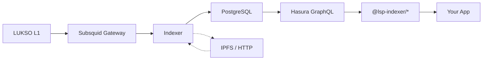
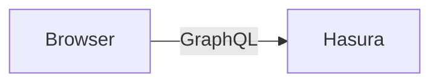
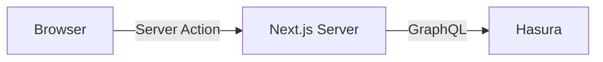

Type-safe React hooks and Next.js server actions for querying LUKSO blockchain data.
Powered by a Subsquid indexer, PostgreSQL, and Hasura GraphQL.

[Get started →](/quickstart)

---

## How It Works



The indexer processes LUKSO blockchain events (LSP0, LSP7, LSP8, LSP26, etc.) into normalized
PostgreSQL tables. Hasura exposes them as a GraphQL API. The consumer packages give you type-safe
hooks to query that API from React or Next.js.

---

## Packages

### @lsp-indexer/types

Shared TypeScript types, Zod schemas, and filter/sort/include definitions used by all other packages.

- Domain types: `Profile`, `DigitalAsset`, `NFT`, `OwnedAsset`, `Creator`, `Follow`, ...
- Filter & sort schemas per domain
- Include field types for partial selects

### @lsp-indexer/node

Low-level GraphQL client, fetch functions, parsers, and query key factories.
The foundation that `react` and `next` packages build on.

- Fetch functions for every domain (`fetchProfile`, `fetchDigitalAssets`, ...)
- Env-aware URL helpers (`getClientUrl`, `getServerUrl`)
- React Query key factories (`profileKeys`, `digitalAssetKeys`, ...)
- Subscription client for real-time WebSocket data

[Documentation →](/node)

### @lsp-indexer/react

Client-side React hooks — the browser connects to Hasura directly.



- `useProfile`, `useDigitalAssets`, `useNfts`, ...
- Infinite scroll hooks (`useInfiniteProfiles`, ...)
- Real-time subscription hooks
- No server required — simple setup

[Documentation →](/react)

### @lsp-indexer/next

Next.js server actions and query hooks — same data-fetching API, but data stays on the server.
Subscriptions use `@lsp-indexer/react` hooks pointed at a WS proxy.



- Server actions for every domain (`getProfile`, `getDigitalAssets`, ...)
- Same query hook API as `@lsp-indexer/react`
- WebSocket proxy server (`@lsp-indexer/next/server`) for hiding Hasura URL
- Subscriptions use `@lsp-indexer/react` — Next.js cannot hold WebSocket connections
- Hasura URL never exposed to browser

[Documentation →](/next)

---

## Supported Domains

| Domain                | Single | List | Infinite | Subscription |
| --------------------- | ------ | ---- | -------- | ------------ |
| Profiles              | ✓      | ✓    | ✓        | ✓            |
| Digital Assets        | ✓      | ✓    | ✓        | ✓            |
| NFTs                  | ✓      | ✓    | ✓        | ✓            |
| Owned Assets          | ✓      | ✓    | ✓        | ✓            |
| Owned Tokens          | ✓      | ✓    | ✓        | ✓            |
| Creators              | —      | ✓    | ✓        | ✓            |
| Issued Assets         | —      | ✓    | ✓        | ✓            |
| Follows               | —      | ✓    | ✓        | ✓            |
| Encrypted Assets      | —      | ✓    | ✓        | ✓            |
| Data Changed Events   | ✓      | ✓    | ✓        | ✓            |
| Token ID Data Changed | ✓      | ✓    | ✓        | ✓            |
| Universal Receiver    | —      | ✓    | ✓        | ✓            |

---

## Quick Example

```tsx
import { useProfile } from '@lsp-indexer/react';

function ProfileCard({ address }: { address: string }) {
  const { profile, isLoading } = useProfile({ address });

  if (isLoading) return <div>Loading...</div>;

  return (
    <div>
      <h2>{profile?.name}</h2>
      <p>{profile?.description}</p>
    </div>
  );
}
```

---

## Next Steps

- [Quickstart Guide](/quickstart) — Install, configure, and start querying
- [Running the Indexer](/indexer) — Docker setup, architecture, monitoring
- [Domain Playgrounds](/profiles) — Try every hook live in the sidebar
