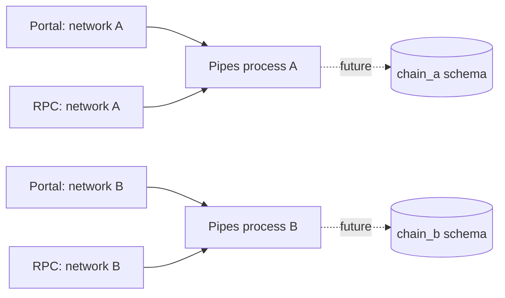
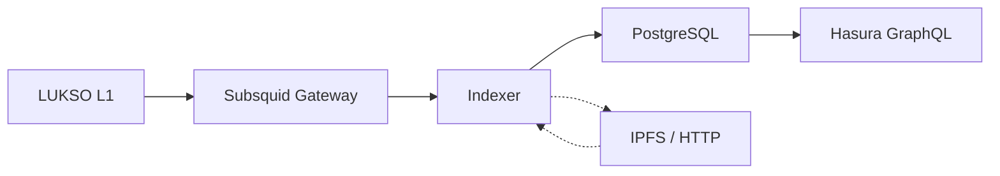

<!-- This file is auto-generated from src/app/docs/indexer/page.mdx.
     Do not edit directly — run `pnpm --filter docs generate` to regenerate. -->

# @lsp-indexer/indexer

The indexer is a [Subsquid](https://subsquid.io/)-based blockchain processor that listens to
LUKSO L1 events, decodes them according to LSP standards, and writes normalized data to PostgreSQL.
Hasura then exposes that database as a GraphQL API.

---

## Indexer v3 alpha development

V3 is being built from scratch in `packages/indexer-v3` on the SQD Pipes SDK. It runs beside the
deployable v2 indexer until domain parity, reorg correctness, package v3 releases, and shadow
production validation are complete. The current alpha foundation includes:

- A typed catalog for LUKSO Mainnet, Ethereum Mainnet, and Ethereum Sepolia
- One validated production network per process with stable EIP-155 Pipes identity
- Portal dataset, coverage, and real-time capability checks
- RPC chain-ID and configured-contract bytecode validation, plus a Viem client for later
  block-pinned contract reads
- Pipes EVM field selection and a bounded raw-log source probe
- A local-only multi-network runner plus an integration test that backfills two sources concurrently

It does **not** yet include Drizzle persistence, LSP decoding, projections, metadata processing,
Hasura views, or the v3 consumer package contracts. Those land in the subsequent v3 goals and the
v2 implementation remains the production path meanwhile.

### Multi-chain process model



Production uses one process or container per network. The SDK's multi-pipe development runner is
not a production supervisor: separate processes provide failure isolation and independent scaling.
Stream IDs and future database schemas are deterministic and cannot collide across the initial
catalog.

| Network key        | Chain ID | Pipes stream ID                  | Reserved database schema |
| ------------------ | -------: | -------------------------------- | ------------------------ |
| `lukso-mainnet`    |       42 | `lsp-indexer:v3:eip155:42`       | `chain_lukso_mainnet`    |
| `ethereum-mainnet` |        1 | `lsp-indexer:v3:eip155:1`        | `chain_ethereum_mainnet` |
| `ethereum-sepolia` | 11155111 | `lsp-indexer:v3:eip155:11155111` | `chain_ethereum_sepolia` |

The registry also carries optional LSP23 factory and LSP26 follower-system deployments with their
first safe indexing block. An unavailable contract is omitted instead of using the zero address.
The exported registry and every nested configuration value are read-only and frozen. Later domain
decoders can therefore select contract-scoped capabilities without scattering chain allowlists
through event modules.

### V3 environment variables

| Variable                          | Required | Default or behavior                                         |
| --------------------------------- | -------- | ----------------------------------------------------------- |
| `INDEXER_NETWORK`                 | Yes      | One network key from the table above                        |
| `INDEXER_FROM_BLOCK`              | No       | Configured network start block                              |
| `INDEXER_TO_BLOCK`                | No       | Inclusive bound; required for `probe:network`               |
| `SQD_PORTAL_URL`                  | No       | Selected network's catalog URL                              |
| `RPC_URL`                         | No       | Generic RPC override                                        |
| `RPC_URL_LUKSO_MAINNET`           | No       | Network override; takes priority over `RPC_URL`             |
| `RPC_URL_ETHEREUM_MAINNET`        | No       | Network override; takes priority over `RPC_URL`             |
| `RPC_URL_ETHEREUM_SEPOLIA`        | No       | Network override; takes priority over `RPC_URL`             |
| `INDEXER_ALLOW_HISTORICAL_SOURCE` | No       | `false`; explicit opt-in for an unbounded historical source |
| `INDEXER_METRICS_PORT`            | No       | `9090` for the local development runner                     |

Every URL, integer, boolean, block range, network key, Portal dataset, Portal starting height, RPC
chain ID, and configured contract deployment is checked before the network program runs.

### Validate a source

V3 requires Node.js 22.15 or newer. Check readiness without consuming blocks:

```bash
INDEXER_NETWORK=ethereum-mainnet \
  pnpm --filter @chillwhales/indexer-v3 check:network
```

Exercise the real Pipes stream with a small inclusive range:

```bash
INDEXER_NETWORK=ethereum-mainnet \
INDEXER_FROM_BLOCK=22000000 \
INDEXER_TO_BLOCK=22000010 \
  pnpm --filter @chillwhales/indexer-v3 probe:network
```

The probe intentionally refuses an unbounded range. It reports the selected network and stream ID,
batch count, block count, log count, and first and last blocks, without writing data. It fails unless
the source returns every block exactly once in ascending order across the inclusive range, so a
partial response is not reported as a successful diagnostic.

### LUKSO live-source gate

The current LUKSO Mainnet Portal metadata reports `real_time: false`. Bounded historical reads are
supported. Setting `INDEXER_ALLOW_HISTORICAL_SOURCE=true` only acknowledges an unbounded historical
source; it does not provide head-following behavior. V3 cannot replace production until an official
real-time Portal or Pipes RPC source passes the restart, finality, and reorg acceptance suite.

The implementation decisions and remaining gates are tracked in the repository's
`V3_ARCHITECTURE.md`, `V3_ROADMAP.md`, and `V3_ACCEPTANCE_GATES.md` documents.

---

## Current v2 architecture



### Pipeline (6 steps)

1. **Extract** — EventPlugins decode blockchain events into entities
2. **Persist Raw** — Batch-insert all raw event entities
3. **Handle** — EntityHandlers create derived entities (token names, tallies, NFT metadata)
4. **Persist Derived** — Batch-insert handler output
5. **Verify** — Batch `supportsInterface()` via Multicall3 to validate addresses
6. **Enrich** — Batch-update FK references on already-persisted entities

### Supported LSP Standards

| Standard | What it indexes                                           |
| -------- | --------------------------------------------------------- |
| LSP0     | Universal Profiles (ERC725Account)                        |
| LSP3     | Profile metadata (name, description, images, links, tags) |
| LSP4     | Digital Asset metadata (token name, symbol, icons)        |
| LSP5     | Received Assets (asset registry per profile)              |
| LSP7     | Fungible token transfers and balances                     |
| LSP8     | NFT transfers, token IDs, and metadata                    |
| LSP12    | Issued Assets (assets created by a profile)               |
| LSP26    | Follower system (follow/unfollow events)                  |
| LSP29    | Encrypted assets                                          |
| LSP31    | URI decoding (multi-backend: IPFS, HTTP, base64)          |

---

## Running with Docker

### Prerequisites

- Docker 24+ and Docker Compose v2
- 8GB RAM minimum (PostgreSQL + Indexer + Hasura + Grafana)

### Quick Start

```bash
git clone https://github.com/chillwhales/lsp-indexer.git
cd lsp-indexer

# Configure environment
cp .env.example .env
# Edit .env — at minimum set:
#   HASURA_GRAPHQL_ADMIN_SECRET=your-secret-here

# Start everything
cd docker
docker compose --env-file ../.env up -d
```

### Services

| Service    | Port | Purpose               |
| ---------- | ---- | --------------------- |
| PostgreSQL | 5432 | Database storage      |
| Hasura     | 8080 | GraphQL API + Console |
| Indexer    | —    | Blockchain processor  |
| Grafana    | 3000 | Monitoring dashboards |
| Loki       | —    | Log aggregation       |
| Prometheus | —    | Metrics storage       |

### Environment Variables

```env
# Database
POSTGRES_USER=postgres
POSTGRES_PASSWORD=postgres
POSTGRES_DB=postgres

# Blockchain sources
SQD_GATEWAY=https://v2.archive.subsquid.io/network/lukso-mainnet
RPC_URL=https://rpc.lukso.sigmacore.io
RPC_RATE_LIMIT=10
FINALITY_CONFIRMATION=75

# IPFS & Metadata
IPFS_GATEWAY=https://api.universalprofile.cloud/ipfs/
METADATA_WORKER_POOL_SIZE=4

# Hasura
HASURA_GRAPHQL_ADMIN_SECRET=your-secret-here
HASURA_GRAPHQL_ENABLE_CONSOLE=true
```

### Logs and Monitoring

```bash
# Follow indexer logs
docker compose --env-file ../.env logs -f indexer

# Open Hasura Console
open http://localhost:8080/console

# Open Grafana dashboards
open http://localhost:3000
```

---

## Running from Source

For development on the indexer itself:

```bash
# Install dependencies
pnpm install

# Build the indexer (runs codegen + tsc)
pnpm --filter=@chillwhales/indexer build

# Run (requires PostgreSQL and Hasura running)
cd packages/indexer
node lib/app/index.js
```

---

## Hasura Configuration

On first startup, the indexer's entrypoint script automatically configures Hasura:

- Tracks all tables as GraphQL types
- Creates relationships between entities
- Sets up public read access (no auth required for queries)
- Configures subscriptions via WebSocket

After initial setup, the Hasura Console at `http://localhost:8080/console` lets you browse
the schema, run queries, and inspect relationships.

---

## Data Model

The indexer produces these main entity types:

| Entity         | Table             | Description                           |
| -------------- | ----------------- | ------------------------------------- |
| Profile        | `profile`         | Universal Profiles with LSP3 metadata |
| DigitalAsset   | `digital_asset`   | LSP7/LSP8 tokens with LSP4 metadata   |
| NFT            | `nft`             | Individual LSP8 token instances       |
| OwnedAsset     | `owned_asset`     | Profile → asset ownership             |
| OwnedToken     | `owned_token`     | Profile → NFT token ownership         |
| Creator        | `creator`         | Profile → asset creator relationship  |
| IssuedAsset    | `issued_asset`    | Assets issued by a profile            |
| Follow         | `follow`          | LSP26 follower relationships          |
| Transfer       | `transfer`        | LSP7 and LSP8 transfer events         |
| DataChanged    | `data_changed`    | ERC725Y data key change events        |
| EncryptedAsset | `encrypted_asset` | LSP29 encrypted asset metadata        |

---

## Next Steps

- [Quickstart](/docs/quickstart) — Install consumer packages and start querying
- [@lsp-indexer/node](/docs/node) — Low-level fetch functions and query keys
- [@lsp-indexer/react](/docs/react) — Client-side React hooks
- [@lsp-indexer/next](/docs/next) — Next.js server actions and hooks
