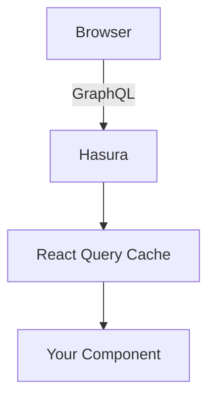

<!-- This file is auto-generated from src/app/docs/react/page.mdx.
     Do not edit directly — run `pnpm --filter docs generate` to regenerate. -->

# @lsp-indexer/react

Client-side React hooks for querying the multi-chain v3 indexer. The browser connects to Hasura
directly—no server is needed. The package is built on `@tanstack/react-query` and delegates all
query semantics to `@lsp-indexer/node`.

```bash
npm install @lsp-indexer/react@^3 @tanstack/react-query
```

---

## Environment Setup

Set the client-side env var (browser-accessible):

```env
NEXT_PUBLIC_INDEXER_URL=http://localhost:8080/v1/graphql
NEXT_PUBLIC_INDEXER_NETWORK=lukso-mainnet
# Optional — for subscriptions
NEXT_PUBLIC_INDEXER_WS_URL=ws://localhost:8080/v1/graphql
```

The `NEXT_PUBLIC_` prefix exposes the URL and selected network to the browser. This is intentional:
the browser needs both to make an exact chain-scoped request. Do **not** put secrets in these
variables. Hooks still receive `network` explicitly; the environment helper never silently selects
a chain.

---

## Provider Setup

Wrap your app with `QueryClientProvider` and (optionally) `IndexerSubscriptionProvider`:

```tsx
'use client';

import { QueryClient, QueryClientProvider } from '@tanstack/react-query';
import { IndexerSubscriptionProvider } from '@lsp-indexer/react';
import { useState } from 'react';

export function Providers({ children }: { children: React.ReactNode }) {
  const [queryClient] = useState(
    () =>
      new QueryClient({
        defaultOptions: { queries: { staleTime: 60_000 } },
      }),
  );

  return (
    <QueryClientProvider client={queryClient}>
      <IndexerSubscriptionProvider>{children}</IndexerSubscriptionProvider>
    </QueryClientProvider>
  );
}
```

The subscription provider is optional — only needed if you use `use*Subscription` hooks.
It creates a single shared WebSocket connection to Hasura.

For the uniform v3 hooks, `IndexerProvider` creates one shared Node client for HTTP and WebSocket
transport and also satisfies every familiar subscription hook. Requests still contain an explicit
`network`; the provider does not add hidden request identity.

```tsx
import { IndexerProvider } from '@lsp-indexer/react';

<QueryClientProvider client={queryClient}>
  <IndexerProvider
    url={process.env.NEXT_PUBLIC_INDEXER_URL!}
    wsUrl={process.env.NEXT_PUBLIC_INDEXER_WS_URL}
    network="lukso-mainnet"
  >
    {children}
  </IndexerProvider>
</QueryClientProvider>;
```

`useIndexerClient()` exposes the scoped Node client and `useIndexerNetwork()` exposes its configured
default so an application can pass that value explicitly to hooks. Changing `url`, `wsUrl`, or
`network` creates the replacement client and disposes the old connection on cleanup.

---

## Hook Patterns

Every hook parameter object includes a required `network`. It is included in every React Query key,
so identical addresses on different chains cannot share cached results. Most domains follow the
same four-hook pattern:

### Single entity — `useProfile`

```tsx
import { useProfile } from '@lsp-indexer/react';

function ProfileCard({ address }: { address: string }) {
  const { profile, isLoading, error, isFetching } = useProfile({
    network: 'lukso-mainnet',
    address,
  });

  if (isLoading) return <Skeleton />;
  if (error) return <ErrorAlert error={error} />;

  return <div>{profile?.name}</div>;
}
```

### Paginated list — `useProfiles`

```tsx
import { useProfiles } from '@lsp-indexer/react';

function ProfileList() {
  const { profiles, totalCount, isLoading, error } = useProfiles({
    network: 'lukso-mainnet',
    filter: { name: 'whale' },
    sort: { field: 'newest', direction: 'desc' },
    limit: 10,
  });

  return (
    <div>
      <p>{totalCount} results</p>
      {profiles?.map((p) => <div key={p.address}>{p.name}</div>)}
    </div>
  );
}
```

### Infinite scroll — `useInfiniteProfiles`

```tsx
import { useInfiniteProfiles } from '@lsp-indexer/react';

function InfiniteProfileList() {
  const { profiles, hasNextPage, fetchNextPage, isFetchingNextPage } = useInfiniteProfiles({
    network: 'lukso-mainnet',
    filter: { name: 'whale' },
    pageSize: 20,
  });

  return (
    <div>
      {profiles?.map((p) => <div key={p.address}>{p.name}</div>)}
      {hasNextPage && (
        <button onClick={() => fetchNextPage()} disabled={isFetchingNextPage}>
          Load more
        </button>
      )}
    </div>
  );
}
```

### Real-time subscription — `useProfileSubscription`

```tsx
import { useProfileSubscription } from '@lsp-indexer/react';

function LiveProfiles() {
  const { data, isConnected, isSubscribed, error } = useProfileSubscription({
    network: 'lukso-mainnet',
    filter: { name: 'whale' },
    limit: 10,
  });

  return (
    <div>
      <span>{isConnected ? 'Connected' : 'Disconnected'}</span>
      {data?.map((p) => <div key={p.address}>{p.name}</div>)}
    </div>
  );
}
```

---

## Available Domains

The familiar consumer domains retain their domain-shaped hooks:

| Domain                | Hooks                                                                                                                                                                                                                                                                                    |
| --------------------- | ---------------------------------------------------------------------------------------------------------------------------------------------------------------------------------------------------------------------------------------------------------------------------------------- |
| Profiles              | `useProfile`, `useProfiles`, `useInfiniteProfiles`, `useProfileSubscription`                                                                                                                                                                                                             |
| Digital Assets        | `useDigitalAsset`, `useDigitalAssets`, `useInfiniteDigitalAssets`, `useDigitalAssetSubscription`                                                                                                                                                                                         |
| NFTs                  | `useNft`, `useNfts`, `useInfiniteNfts`, `useNftSubscription`                                                                                                                                                                                                                             |
| Owned Assets          | `useOwnedAsset`, `useOwnedAssets`, `useInfiniteOwnedAssets`, `useOwnedAssetSubscription`                                                                                                                                                                                                 |
| Owned Tokens          | `useOwnedToken`, `useOwnedTokens`, `useInfiniteOwnedTokens`, `useOwnedTokenSubscription`                                                                                                                                                                                                 |
| Creators              | `useCreators`, `useInfiniteCreators`, `useCreatorSubscription`                                                                                                                                                                                                                           |
| Issued Assets         | `useIssuedAssets`, `useInfiniteIssuedAssets`, `useIssuedAssetSubscription`                                                                                                                                                                                                               |
| Follows               | `useFollows`, `useInfiniteFollows`, `useFollowCount`, `useIsFollowing`, `useIsFollowingBatch`, `useFollowerSubscription`, `useMutualFollows`, `useInfiniteMutualFollows`, `useMutualFollowers`, `useInfiniteMutualFollowers`, `useFollowedByMyFollows`, `useInfiniteFollowedByMyFollows` |
| Encrypted Assets      | `useEncryptedAssets`, `useInfiniteEncryptedAssets`, `useEncryptedAssetsBatch`, `useEncryptedAssetSubscription`                                                                                                                                                                           |
| Data Changed          | `useDataChangedEvents`, `useInfiniteDataChangedEvents`, `useLatestDataChangedEvent`, `useDataChangedEventSubscription`                                                                                                                                                                   |
| Token ID Data Changed | `useTokenIdDataChangedEvents`, `useInfiniteTokenIdDataChangedEvents`, `useLatestTokenIdDataChangedEvent`, `useTokenIdDataChangedEventSubscription`                                                                                                                                       |
| Universal Receiver    | `useUniversalReceiverEvents`, `useInfiniteUniversalReceiverEvents`, `useUniversalReceiverEventSubscription`                                                                                                                                                                              |
| Collection Attributes | `useCollectionAttributes`                                                                                                                                                                                                                                                                |
| Chillwhales NFTs (v3) | `useChillwhalesNfts`, `useInfiniteChillwhalesNfts`, `useChillwhalesNftSubscription`                                                                                                                                                                                                      |

### Uniform v3 hooks

`useV3List`, `useV3Infinite`, and `useV3Subscription` expose the same typed interface for all 15
public v3 roots. They delegate filters, sorts, parsing, and subscriptions to `@lsp-indexer/node`.
Infinite keys include network, domain, filter, sort, and page size; the next offset advances by the
rows actually returned and stops when `totalCount` is loaded.

```tsx
import { useV3Infinite, useV3Subscription } from '@lsp-indexer/react';

const controllers = useV3Infinite('controllers', {
  network: 'lukso-mainnet',
  filter: { profileAddress: { eq: profileAddress } },
  sort: [{ field: 'arrayIndex', direction: 'asc', nulls: 'last' }],
  pageSize: 25,
});

const liveHeads = useV3Subscription(
  'indexedHeads',
  { network: 'lukso-mainnet', limit: 1 },
  { invalidate: true },
);
```

| Domain argument     | Named convenience hooks                                                 |
| ------------------- | ----------------------------------------------------------------------- |
| `blocks`            | `useBlocks`, `useInfiniteBlocks`, `useBlockSubscription`                |
| `events`            | `useEvents`, `useInfiniteEvents`, `useEventSubscription`                |
| `profiles`          | Use the uniform hooks or familiar profile hooks above                   |
| `digitalAssets`     | Use the uniform hooks or familiar digital-asset hooks above             |
| `nfts`              | Use the uniform hooks or familiar NFT hooks above                       |
| `ownedAssets`       | Use the uniform hooks or familiar owned-asset hooks above               |
| `ownedTokens`       | Use the uniform hooks or familiar owned-token hooks above               |
| `followers`         | Use the uniform hooks or familiar follower hooks above                  |
| `creators`          | Use the uniform hooks or familiar creator hooks above                   |
| `issuedAssets`      | Use the uniform hooks or familiar issued-asset hooks above              |
| `controllers`       | `useControllers`, `useInfiniteControllers`, `useControllerSubscription` |
| `chillwhalesNfts`   | `useChillwhalesNfts`, infinite, and subscription variants               |
| `dataValues`        | `useDataValues`, `useInfiniteDataValues`, `useDataValueSubscription`    |
| `metadataRevisions` | `useMetadataRevisions`, infinite, and subscription variants             |
| `indexedHeads`      | `useIndexedHead(s)`, `useIndexedHeadSubscription`                       |

The generic return type is selected by the domain argument, so `items` and subscription `data`
never become a union of all domain records. When `invalidate: true`, live data and reconnect events
invalidate that exact network/domain cache by default; `invalidateKeys` can override the target.

---

## Batch Follow Checking

`useIsFollowingBatch` checks multiple follower→followed address pairs in a single Hasura query. Returns a `Map<string, boolean>` keyed by `"followerAddress:followedAddress"`.

### Parameters

| Parameter | Type                                                          | Required | Description                              |
| --------- | ------------------------------------------------------------- | -------- | ---------------------------------------- |
| `network` | `string`                                                      | Yes      | Exact v3 network slug                    |
| `pairs`   | `Array<{ followerAddress: string; followedAddress: string }>` | Yes      | Address pairs to check follow status for |

### Usage

```tsx
import { useIsFollowingBatch } from '@lsp-indexer/react';

const pairs = [
  { followerAddress: '0xFollower1', followedAddress: '0xFollowed1' },
  { followerAddress: '0xFollower2', followedAddress: '0xFollowed2' },
];

const { results, isLoading, error } = useIsFollowingBatch({
  network: 'lukso-mainnet',
  pairs,
});
// Keys are lowercased — any address casing is accepted as input:
// results.get('0xfollower1:0xfollowed1') → true | false
// results.get('0xfollower2:0xfollowed2') → true | false
```

The hook is disabled when `pairs` is empty — no query is fired and `results` defaults to an empty `Map`. All pairs default to `false`; a missing row means "not following", not an error.

---

## Batch Encrypted Asset Fetch

`useEncryptedAssetsBatch` fetches multiple encrypted assets by `(address, contentId, revision)` tuples. It transparently pages Hasura when duplicate immutable revisions require another batch.

### Parameters

| Parameter | Type                         | Required | Description                                                                  |
| --------- | ---------------------------- | -------- | ---------------------------------------------------------------------------- |
| `network` | `string`                     | Yes      | Exact v3 network slug                                                        |
| `tuples`  | `EncryptedAssetBatchTuple[]` | Yes      | Array of `{ address: string, contentId: string, revision: number }` to fetch |
| `include` | `EncryptedAssetInclude`      | No       | Narrow which related fields are returned — full TypeScript inference         |

### Usage

```tsx
import { useEncryptedAssetsBatch } from '@lsp-indexer/react';

const tuples = [
  { address: '0xAssetAddress1', contentId: 'content-1', revision: 1 },
  { address: '0xAssetAddress2', contentId: 'content-2', revision: 0 },
];

const { encryptedAssets, isLoading, error } = useEncryptedAssetsBatch({
  network: 'lukso-mainnet',
  tuples,
  include: { encryption: true },
});
// encryptedAssets → EncryptedAsset[] (one per matched tuple)
```

The hook is disabled when `tuples` is empty — no query is fired and `encryptedAssets` defaults to `[]`.
If no tuples match, `encryptedAssets` returns `[]` — no error is thrown.
Address matching is case-insensitive. Duplicate tuples are coalesced, and each unique tuple returns at most its newest canonical revision in input order.
`EncryptedAssetInclude` narrows the return type. The return shape has no `totalCount`.

---

## Mutual Follow Queries

Three hook families query intersection relationships across the follow graph. Each comes in a
standard paginated version and an infinite-scroll version. All hooks accept a single params object
and return `{ profiles, totalCount, isLoading, error, isFetching }`. Queries stay idle until both
addresses are provided.

| Hook                             | Description                                                            |
| -------------------------------- | ---------------------------------------------------------------------- |
| `useMutualFollows`               | Profiles that both `addressA` and `addressB` follow                    |
| `useInfiniteMutualFollows`       | Infinite-scroll variant of `useMutualFollows`                          |
| `useMutualFollowers`             | Profiles that follow both `addressA` and `addressB`                    |
| `useInfiniteMutualFollowers`     | Infinite-scroll variant of `useMutualFollowers`                        |
| `useFollowedByMyFollows`         | Profiles that `myAddress` follows and that also follow `targetAddress` |
| `useInfiniteFollowedByMyFollows` | Infinite-scroll variant of `useFollowedByMyFollows`                    |

### Parameters

**`useMutualFollows` / `useMutualFollowers`:**

| Param      | Type             | Required | Description                    |
| ---------- | ---------------- | -------- | ------------------------------ |
| `network`  | `string`         | Yes      | Exact v3 network slug          |
| `addressA` | `string`         | Yes      | First address                  |
| `addressB` | `string`         | Yes      | Second address                 |
| `sort`     | `ProfileSort`    | No       | Sort field, direction, nulls   |
| `limit`    | `number`         | No       | Max results (default: server)  |
| `offset`   | `number`         | No       | Pagination offset              |
| `include`  | `ProfileInclude` | No       | Include narrowing for profiles |

**`useFollowedByMyFollows`:**

| Param           | Type             | Required | Description                    |
| --------------- | ---------------- | -------- | ------------------------------ |
| `network`       | `string`         | Yes      | Exact v3 network slug          |
| `myAddress`     | `string`         | Yes      | Your address                   |
| `targetAddress` | `string`         | Yes      | Target profile address         |
| `sort`          | `ProfileSort`    | No       | Sort field, direction, nulls   |
| `limit`         | `number`         | No       | Max results (default: server)  |
| `offset`        | `number`         | No       | Pagination offset              |
| `include`       | `ProfileInclude` | No       | Include narrowing for profiles |

Infinite variants (`useInfiniteMutualFollows`, etc.) replace `limit`/`offset` with `pageSize?: number`.

### Usage

```tsx
import { useMutualFollows } from '@lsp-indexer/react';
import type { ProfileInclude } from '@lsp-indexer/types';

const include: ProfileInclude = { name: true, tags: true };

function MutualFollows({ addressA, addressB }: { addressA: string; addressB: string }) {
  const { profiles, totalCount, isLoading, error } = useMutualFollows({
    network: 'lukso-mainnet',
    addressA,
    addressB,
    sort: { field: 'newest', direction: 'desc' },
    limit: 10,
    include,
  });

  if (isLoading) return <p>Loading…</p>;
  if (error) return <p>Error: {error.message}</p>;

  return (
    <div>
      <p>{totalCount} mutual follows</p>
      {profiles?.map((p) => (
        <div key={p.address}>
          {p.name}
          {/* p.tags is typed — include narrowing works */}
        </div>
      ))}
    </div>
  );
}
```

`useFollowedByMyFollows` uses `myAddress` and `targetAddress` instead of `addressA`/`addressB`:

```tsx
import { useFollowedByMyFollows } from '@lsp-indexer/react';

const { profiles } = useFollowedByMyFollows({
  network: 'lukso-mainnet',
  myAddress,
  targetAddress,
  limit: 20,
});
```

---

## Collection Attributes

`useCollectionAttributes` fetches the distinct `{key, value}` attribute pairs across all NFTs in a collection, along with the total NFT count. Useful for building trait filters, rarity explorers, and collection overviews.

### Parameters

| Parameter           | Type     | Required | Description                            |
| ------------------- | -------- | -------- | -------------------------------------- |
| `network`           | `string` | Yes      | Exact v3 network slug                  |
| `collectionAddress` | `string` | Yes      | Contract address of the NFT collection |

### Return Shape

| Field        | Type                    | Description                                       |
| ------------ | ----------------------- | ------------------------------------------------- |
| `attributes` | `CollectionAttribute[]` | Distinct `{ key, value, type }` attribute entries |
| `totalCount` | `number`                | Total number of NFTs in the collection            |
| `isLoading`  | `boolean`               | `true` while the initial fetch is in progress     |
| `error`      | `Error \| null`         | Error object if the query failed                  |

### Usage

```tsx
import { useCollectionAttributes } from '@lsp-indexer/react';

function TraitFilter({ collectionAddress }: { collectionAddress: string }) {
  const { attributes, totalCount, isLoading, error } = useCollectionAttributes({
    network: 'lukso-mainnet',
    collectionAddress,
  });

  if (isLoading) return <p>Loading traits…</p>;
  if (error) return <p>Error: {error.message}</p>;

  return (
    <div>
      <p>{totalCount} NFTs in collection</p>
      <ul>
        {attributes?.map((attr) => (
          <li key={`${attr.key}:${attr.value}`}>
            {attr.key}: {attr.value} {attr.type && <span>({attr.type})</span>}
          </li>
        ))}
      </ul>
    </div>
  );
}
```

---

## Include Fields

Control which related data is fetched to reduce payload size:

```tsx
import { useProfile } from '@lsp-indexer/react';
import type { ProfileInclude } from '@lsp-indexer/types';

const include: ProfileInclude = {
  name: true,
  description: true,
  tags: true,
  links: true,
  profileImage: true,
};

const { profile } = useProfile({ network: 'lukso-mainnet', address: '0x...', include });
// profile.name → string | null (included)
// profile.avatar → undefined (not included)
```

The TypeScript return type narrows automatically based on your include selection. Omitting
`include` returns the full familiar result; `include: {}` returns only mandatory identity and
provenance fields. Every top-level result includes `network` and `chainId`, and projection/event
results carry canonical block and transaction provenance.

### NFT Include Fields

NFTs support granular include control for Chillwhales-specific fields. Passing an explicit include
object opts into only the selected fields:

```tsx
import { useNfts } from '@lsp-indexer/react';
import type { NftInclude } from '@lsp-indexer/types';

const include: NftInclude = {
  score: true,
  rank: true,
  chillClaimed: true,
  orbsClaimed: true,
  level: true,
  cooldownExpiry: true,
  faction: true,
  collection: { name: true },
  holder: { name: true },
};

const { nfts } = useNfts({
  network: 'lukso-mainnet',
  filter: { collectionAddress: '0x...' },
  include,
});
// nfts[0].score → number | null (included)
// nfts[0].description → undefined (not included)
```

All NFT include fields: `formattedTokenId`, `name`, `description`, `category`, `icons`, `images`,
`links`, `attributes`, `timestamp`, `blockNumber`, `transactionIndex`, `logIndex`, `score`, `rank`,
`chillClaimed`, `orbsClaimed`, `level`, `cooldownExpiry`, `faction`. Relations: `collection`
(accepts `boolean | DigitalAssetInclude`), `holder` (accepts `boolean | ProfileInclude`).
Nested holder includes retain `timestamp: string | null`; v3 currently returns `null` because the
read model has no acquisition timestamp.

---

## Filters and Sorting

All list hooks accept `filter` and `sort` parameters:

```tsx
import type { DigitalAssetFilter, DigitalAssetSort } from '@lsp-indexer/types';

const filter: DigitalAssetFilter = {
  name: 'CHILL',
  tokenType: 'TOKEN',
};

const sort: DigitalAssetSort = {
  field: 'totalSupply',
  direction: 'desc',
  nulls: 'last',
};

const { digitalAssets } = useDigitalAssets({
  network: 'lukso-mainnet',
  filter,
  sort,
  limit: 10,
});
```

Familiar v3 text filters use exact, case-sensitive matching. Hexadecimal addresses and canonical
hashes are validated and normalized before querying, and supplied empty hexadecimal values fail
validation rather than disabling the filter. Digital-asset `name` and `symbol` filters use the
projection value first and current LSP4 metadata only when that projection field is null, matching
the returned record. Sort supports `asc`/`desc` direction and `first`/`last` null positioning;
compatibility-only sort fields that v3 cannot represent fail with `VALIDATION_FAILED` rather than
being ignored.

### NFT Filters and Sorting

NFTs support Chillwhales-specific filter fields and deterministic token sorting:

```tsx
import type { NftFilter, NftSort } from '@lsp-indexer/types';

const filter: NftFilter = {
  collectionAddress: '0x...',
  chillClaimed: false, // Only unclaimed
  orbsClaimed: false,
  maxLevel: 5, // Level 5 or below
  cooldownExpiryBefore: Math.floor(Date.now() / 1000), // Cooldown expired
};

const sort: NftSort = {
  field: 'tokenId',
  direction: 'asc',
  nulls: 'last',
};

const { nfts } = useNfts({ network: 'lukso-mainnet', filter, sort, limit: 20 });
```

**NFT filter fields:** `collectionAddress`, `tokenId`, `formattedTokenId`, `name`, `holderAddress`,
`isBurned`, `isMinted`, `chillClaimed`, `orbsClaimed`, `maxLevel`, `cooldownExpiryBefore`.

**NFT sort fields:** `newest`, `oldest`, `tokenId`, and `formattedTokenId`. The legacy `score`
input remains typed for migration diagnostics but v3 rejects it with a field-level
`VALIDATION_FAILED` error because the public view cannot execute that order safely.
`newest`/`oldest` use deterministic block-order; `direction`/`nulls` are ignored for those values.

---

## Subscriptions

Subscriptions use a shared WebSocket connection managed by `IndexerSubscriptionProvider`.

Key behaviors:

- **Auto-reconnect** on connection loss
- **Shared connection** — all subscription hooks share one WebSocket
- **Cache invalidation** — set `invalidate: true` to auto-invalidate React Query cache on updates
- **Connection status** — `isConnected` and `isSubscribed` flags for UI indicators

```tsx
const { data, isConnected, isSubscribed, error } = useDigitalAssetSubscription({
  network: 'lukso-mainnet',
  filter: { tokenType: 'NFT' },
  limit: 50,
  invalidate: true, // invalidate useDigitalAssets() cache on updates
});
```

> **Using with `@lsp-indexer/next`?** If you use `@lsp-indexer/next` for server actions but still
> want real-time subscriptions, use `@lsp-indexer/react` subscription hooks and set
> `NEXT_PUBLIC_INDEXER_WS_URL` to your WS proxy URL (from `@lsp-indexer/next/server`).
> This keeps the Hasura URL hidden from the browser while enabling real-time updates.
> See the [@lsp-indexer/next docs](/docs/next#why-subscriptions-use-lsp-indexerreact) for details.

---

## Data Flow


```mermaid
graph TD
  A[Browser] -->|GraphQL| B[Hasura]
  B --> C[React Query Cache]
  C --> D[Your Component]
```

Pros: Simple, no server needed, real-time subscriptions via WebSocket.

Cons: Hasura URL is exposed to the browser, no server-side caching or access control.

For server-side data fetching, see [@lsp-indexer/next](/docs/next).

---

## Next Steps

- [@lsp-indexer/next](/docs/next) — Server actions and hooks for Next.js
- [@lsp-indexer/node](/docs/node) — Low-level fetch functions, parsers, query keys
- [Quickstart](/docs/quickstart) — End-to-end setup guide
- [Domain Playgrounds](/profiles) — Try every hook live
