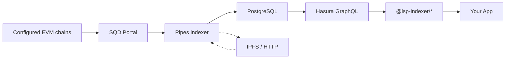
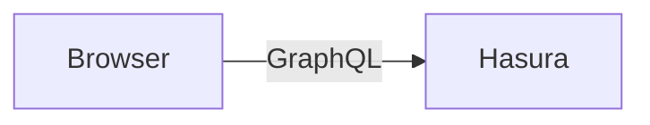
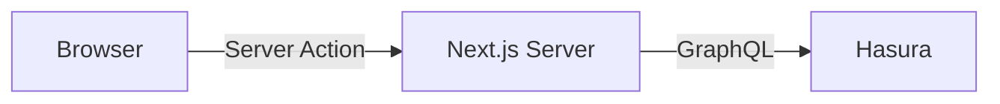

# @lsp-indexer

Type-safe Node, React, and Next.js packages for querying multi-chain LSP data.
V3 is powered by SQD Pipes, PostgreSQL, and Hasura GraphQL.

[Get started →](/docs/quickstart)

---

## How It Works



The v3 indexer processes supported EVM/LSP events into chain-isolated PostgreSQL schemas. Hasura
exposes unified, read-only multi-chain views. The consumer packages validate that API at runtime
and expose explicit network-scoped Node services, React hooks, and Next.js server actions.

---

## Packages

### @lsp-indexer/types

Shared TypeScript types, Zod schemas, and filter/sort/include definitions used by all other packages.

- Familiar domain types plus runtime v3 schemas for all 15 public API roots
- Required `NetworkRef`, `BlockRef`, `EventRef`, and projection provenance
- Filter & sort schemas per domain
- Include field types for partial selects

### @lsp-indexer/node

Low-level GraphQL client, fetch functions, parsers, and query key factories.
The foundation that `react` and `next` packages build on.

- Familiar fetch functions plus `createIndexerClient` and uniform methods for all 15 v3 domains
- Validated URL and required network helpers
- React Query key factories (`profileKeys`, `digitalAssetKeys`, ...)
- Subscription client for real-time WebSocket data

[Documentation →](/docs/node)

### @lsp-indexer/react

Client-side React hooks — the browser connects to Hasura directly.



- `useProfile`, `useDigitalAssets`, `useNfts`, ...
- Infinite scroll hooks (`useInfiniteProfiles`, ...)
- Real-time subscription hooks
- No server required — simple setup

[Documentation →](/docs/react)

### @lsp-indexer/next

Next.js server actions and query hooks — same data-fetching API, but data stays on the server.
Subscriptions use `@lsp-indexer/react` hooks pointed at a WS proxy.



- Server actions for every domain (`getProfile`, `getDigitalAssets`, ...)
- Same query hook API as `@lsp-indexer/react`
- WebSocket proxy server (`@lsp-indexer/next/server`) for hiding Hasura URL
- Subscriptions use `@lsp-indexer/react` — Next.js cannot hold WebSocket connections
- Hasura URL never exposed to browser

[Documentation →](/docs/next)

---

## Supported Domains

| Domain             | Node v3 query + subscription | Familiar React/Next API     |
| ------------------ | ---------------------------- | --------------------------- |
| Blocks             | ✓                            | —                           |
| Event facts        | ✓                            | via familiar event hooks    |
| Profiles           | ✓                            | ✓                           |
| Digital assets     | ✓                            | ✓                           |
| NFTs               | ✓                            | ✓                           |
| Owned assets       | ✓                            | ✓                           |
| Owned tokens       | ✓                            | ✓                           |
| Followers          | ✓                            | ✓                           |
| Creators           | ✓                            | ✓                           |
| Issued assets      | ✓                            | ✓                           |
| LSP6 controllers   | ✓                            | —                           |
| Chillwhales NFTs   | ✓                            | —                           |
| Data values        | ✓                            | via familiar data hooks     |
| Metadata revisions | ✓                            | via familiar metadata hooks |
| Indexed heads      | ✓                            | —                           |

The Node v3 client covers every public Hasura root now. Dedicated hooks/actions for the v3-only
domains and indexed-head/network ergonomics land in the React/Next v3 goal. `chillwhales_nfts` is
populated only on LUKSO Mainnet, where its source contracts are configured.

---

## Quick Example

```tsx
import { useProfile } from '@lsp-indexer/react';

function ProfileCard({ address }: { address: string }) {
  const { profile, isLoading } = useProfile({ network: 'lukso-mainnet', address });

  if (isLoading) return <div>Loading...</div>;

  return (
    <div>
      <h2>{profile?.name}</h2>
      <p>{profile?.description}</p>
    </div>
  );
}
```

---

## Next Steps

- [Quickstart Guide](/docs/quickstart) — Install, configure, and start querying
- [Running the Indexer](/docs/indexer) — Docker setup, architecture, monitoring
- [Domain Playgrounds](/profiles) — Try every hook live in the sidebar
