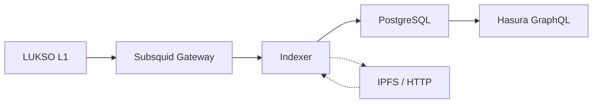

# @lsp-indexer/indexer

The indexer is a [Subsquid](https://subsquid.io/)-based blockchain processor that listens to
LUKSO L1 events, decodes them according to LSP standards, and writes normalized data to PostgreSQL.
Hasura then exposes that database as a GraphQL API.

---

## Architecture



### Pipeline (6 steps)

1. **Extract** — EventPlugins decode blockchain events into entities
2. **Persist Raw** — Batch-insert all raw event entities
3. **Handle** — EntityHandlers create derived entities (token names, tallies, NFT metadata)
4. **Persist Derived** — Batch-insert handler output
5. **Verify** — Batch `supportsInterface()` via Multicall3 to validate addresses
6. **Enrich** — Batch-update FK references on already-persisted entities

### Supported LSP Standards

| Standard | What it indexes                                           |
| -------- | --------------------------------------------------------- |
| LSP0     | Universal Profiles (ERC725Account)                        |
| LSP3     | Profile metadata (name, description, images, links, tags) |
| LSP4     | Digital Asset metadata (token name, symbol, icons)        |
| LSP5     | Received Assets (asset registry per profile)              |
| LSP7     | Fungible token transfers and balances                     |
| LSP8     | NFT transfers, token IDs, and metadata                    |
| LSP12    | Issued Assets (assets created by a profile)               |
| LSP26    | Follower system (follow/unfollow events)                  |
| LSP29    | Encrypted assets                                          |
| LSP31    | URI decoding (multi-backend: IPFS, HTTP, base64)          |

---

## Running with Docker

### Prerequisites

- Docker 24+ and Docker Compose v2
- 8GB RAM minimum (PostgreSQL + Indexer + Hasura + Grafana)

### Quick Start

```bash
git clone https://github.com/chillwhales/lsp-indexer.git
cd lsp-indexer

# Configure environment
cp .env.example .env
# Edit .env — at minimum set:
#   HASURA_GRAPHQL_ADMIN_SECRET=your-secret-here

# Start everything
cd docker
docker compose --env-file ../.env up -d
```

### Services

| Service    | Port | Purpose               |
| ---------- | ---- | --------------------- |
| PostgreSQL | 5432 | Database storage      |
| Hasura     | 8080 | GraphQL API + Console |
| Indexer    | —    | Blockchain processor  |
| Grafana    | 3000 | Monitoring dashboards |
| Loki       | —    | Log aggregation       |
| Prometheus | —    | Metrics storage       |

### Environment Variables

```env
# Database
POSTGRES_USER=postgres
POSTGRES_PASSWORD=postgres
POSTGRES_DB=postgres

# Blockchain sources
SQD_GATEWAY=https://v2.archive.subsquid.io/network/lukso-mainnet
RPC_URL=https://rpc.lukso.sigmacore.io
RPC_RATE_LIMIT=10
FINALITY_CONFIRMATION=75

# IPFS & Metadata
IPFS_GATEWAY=https://api.universalprofile.cloud/ipfs/
METADATA_WORKER_POOL_SIZE=4

# Hasura
HASURA_GRAPHQL_ADMIN_SECRET=your-secret-here
HASURA_GRAPHQL_ENABLE_CONSOLE=true
```

### Logs and Monitoring

```bash
# Follow indexer logs
docker compose --env-file ../.env logs -f indexer

# Open Hasura Console
open http://localhost:8080/console

# Open Grafana dashboards
open http://localhost:3000
```

---

## Running from Source

For development on the indexer itself:

```bash
# Install dependencies
pnpm install

# Build codegen packages first
pnpm --filter=@chillwhales/abi build
pnpm --filter=@chillwhales/typeorm build

# Build the indexer
pnpm --filter=@chillwhales/indexer build

# Run (requires PostgreSQL and Hasura running)
cd packages/indexer
node lib/app/index.js
```

---

## Hasura Configuration

On first startup, the indexer's entrypoint script automatically configures Hasura:

- Tracks all tables as GraphQL types
- Creates relationships between entities
- Sets up public read access (no auth required for queries)
- Configures subscriptions via WebSocket

After initial setup, the Hasura Console at `http://localhost:8080/console` lets you browse
the schema, run queries, and inspect relationships.

---

## Data Model

The indexer produces these main entity types:

| Entity         | Table             | Description                           |
| -------------- | ----------------- | ------------------------------------- |
| Profile        | `profile`         | Universal Profiles with LSP3 metadata |
| DigitalAsset   | `digital_asset`   | LSP7/LSP8 tokens with LSP4 metadata   |
| NFT            | `nft`             | Individual LSP8 token instances       |
| OwnedAsset     | `owned_asset`     | Profile → asset ownership             |
| OwnedToken     | `owned_token`     | Profile → NFT token ownership         |
| Creator        | `creator`         | Profile → asset creator relationship  |
| IssuedAsset    | `issued_asset`    | Assets issued by a profile            |
| Follow         | `follow`          | LSP26 follower relationships          |
| Transfer       | `transfer`        | LSP7 and LSP8 transfer events         |
| DataChanged    | `data_changed`    | ERC725Y data key change events        |
| EncryptedAsset | `encrypted_asset` | LSP29 encrypted asset metadata        |

---

## Database Backup & Recovery

The production Docker Compose stack includes an automated backup sidecar that runs
`pg_dump` on a configurable cron schedule with a default 7-day retention policy. Because
all indexed data is re-derivable from the LUKSO blockchain, the strategy optimizes for
fast recovery over zero-data-loss.

### Backup Environment Variables

| Variable                | Default     | Description                                    |
| ----------------------- | ----------- | ---------------------------------------------- |
| `BACKUP_SCHEDULE`       | `0 2 * * *` | Cron schedule (default: daily at 2 AM UTC)     |
| `BACKUP_RETENTION_DAYS` | `7`         | Days to keep backups before automatic deletion |
| `BACKUP_DIR`            | `/backups`  | Backup directory inside the container          |
| `BACKUP_ENABLED`        | `true`      | Set to `false` to disable the backup sidecar   |

### Management Commands

```bash
cd docker

# Run a manual backup immediately
./manage.sh backup

# List available backups with sizes
./manage.sh backup-list

# Verify a backup file is not corrupt
./manage.sh backup-verify backup-20260317-020000.dump

# Full recovery: stops services, restores database, restarts everything
./manage.sh backup-restore backup-20260317-020000.dump
```

For complete recovery procedures, troubleshooting, and off-site backup strategies, see the
[backup runbook](https://github.com/chillwhales/lsp-indexer/blob/main/docs/docker/BACKUP.md).

---

## Next Steps

- [Quickstart](/docs/quickstart) — Install consumer packages and start querying
- [@lsp-indexer/node](/docs/node) — Low-level fetch functions and query keys
- [@lsp-indexer/react](/docs/react) — Client-side React hooks
- [@lsp-indexer/next](/docs/next) — Next.js server actions and hooks
